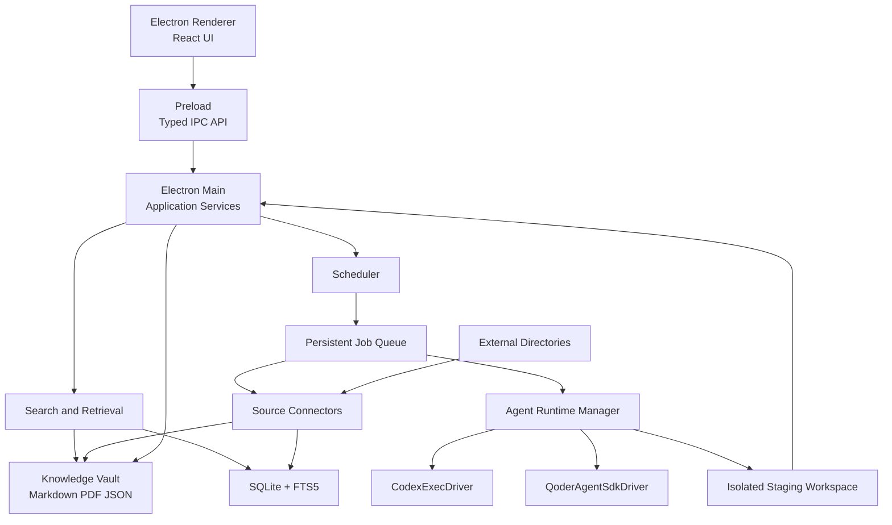

# 本地 Agent 驱动的知识管理客户端：项目 Handoff 与实施计划

> 文档状态：可用于新工作区启动设计与实现
>
> 最后更新：2026-07-21
>
> 目标读者：接手该项目但不了解此前讨论、ClaudeDance 或相关原型的产品与工程人员
>
> 项目名称：待定，本文统一称为“知识客户端”

---

## 0. 如何使用这份文档

这是一份自包含的项目 handoff，同时承担以下用途：

1. 产品范围说明；
2. 技术架构设计；
3. 核心数据模型与文件布局说明；
4. Codex、Qoder 本地 Agent 接入决策；
5. 分阶段实施计划与验收标准；
6. 新工作区启动上下文。

新工作区不需要阅读 ClaudeDance 仓库，也不需要知道此前对话。实现时应以本文为主要输入，在独立的新项目目录中创建代码，不要直接在 ClaudeDance 仓库中继续开发。

本文描述的是目标架构和一期范围。涉及外部 CLI、SDK 的具体参数时，实现前仍应以当时安装版本和官方文档为准，并通过 capability probe 做运行时检测，不要只依赖编译时假设。

---

## 1. 执行摘要

### 1.1 产品定义

知识客户端是一个以本地文件为核心的桌面知识管理应用，主要能力包括：

- 定时从 RSS、arXiv 官方接口和用户指定目录采集内容；
- 将新内容放入收件箱，完成去重、正文提取和基础元数据整理；
- 调用用户电脑上已经安装并登录的 Codex 或 Qoder，对内容进行预标注、分类和摘要；
- 提供人工 Review Queue，用户确认后再进入正式知识库；
- 提供“今天有什么信息”“总结本周内容”“对比选中文档”等知识问答入口；
- 定时生成周报等知识产物；
- 扫描 Codex、Qoder 或其他工作目录中新增的文档产物，并以引用、软链接或复制方式导入；
- 点击 macOS 窗口红色关闭按钮后继续执行同步、扫描和 Agent 任务。

### 1.2 核心定位

这是一个“文件优先的知识系统”，不是聊天客户端，也不是多 Agent 编排器。

系统的一等公民是：

```text
Source → KnowledgeItem → Artifact → Annotation → Review → Collection/Report
```

Agent 只是语义处理器：

```text
Workflow → Job → AgentRun → Validated Result
```

不应把 Codex Thread、Qoder Session 或聊天消息当作知识库的核心数据模型。

### 1.3 一期技术决策

| 领域 | 一期决策 |
|---|---|
| 桌面技术 | Electron + React + TypeScript |
| 主进程职责 | Scheduler、Job Queue、文件系统、SQLite、Agent 进程 |
| 数据真源 | 用户选择的 Knowledge Vault 文件目录 |
| 索引与运行状态 | SQLite，位于应用数据目录，可重建 |
| 全文搜索 | SQLite FTS5；中文优先考虑 trigram 或可替换 tokenizer |
| Codex 接入 | `codex exec` 非交互 CLI |
| Qoder 接入 | Qoder Agent SDK，复用本地 `qodercli` 登录 |
| 聊天记录 | 仅保存知识客户端自己的问题、答案、检索快照和引用 |
| 调度 | Electron Main 内置；红叉隐藏窗口后继续运行 |
| 后台 daemon | 一期不做 |
| Claude Code | 一期不支持 |
| 悟空 | 一期不支持 |
| 向量数据库 | 一期不做 |
| 云端同步 | 一期不做 |

### 1.4 最重要的架构原则

1. 确定性工作交给脚本，语义工作交给 Agent。
2. Agent 不能直接写正式 Vault，只能写隔离的 staging 输出。
3. 所有 Agent 输出必须经过 Schema 校验和应用层提交。
4. Renderer 不直接访问文件、数据库或子进程。
5. 不同步外部 Agent 聊天记录，不依赖外部 Agent Session 恢复。
6. Provider 接入方式可以不同，但对上层暴露统一 `AgentDriver`。
7. 文件 watcher 负责实时性，周期 reconciliation scan 负责最终一致性。
8. SQLite 是索引和运行状态，不是知识内容的唯一真源。

---

## 2. 产品目标与非目标

### 2.1 产品目标

一期需要证明以下闭环成立：

1. 用户可以配置 RSS 和 arXiv 订阅源；
2. 应用可以定时同步并去重；
3. 新内容进入收件箱；
4. Codex 或 Qoder 可以对内容生成结构化预标注；
5. 用户可以确认、修改或拒绝 Agent 建议；
6. 内容确认后进入本地知识库；
7. 用户可以基于本地知识问“今天有什么信息”或“总结本周内容”；
8. 回答可以定位到具体知识条目；
9. 应用可以定时生成周报；
10. 红叉隐藏窗口后，后台任务仍然继续；
11. 应用重启后可以恢复任务状态并处理错过的调度。

### 2.2 一期非目标

一期明确不做：

- 通用 AI 聊天客户端；
- 同步 Codex、Qoder、Claude Code 的聊天历史；
- 复刻外部 Agent 的模型选择、MCP、Skills、插件管理界面；
- 允许 Agent 任意修改正式知识库；
- 多 Agent 自主协商或多轮团队编排；
- Claude Code Provider；
- 阿里悟空或 Wukong Code Provider；
- Codex experimental app-server；
- Qoder ACP Client；
- 独立系统 daemon；
- 多设备同步；
- 团队协作和权限系统；
- 云端账户系统；
- 向量数据库和远程 Embedding API；
- 大规模网页爬虫；
- OCR、音视频转写等重型内容管线；
- 自动发布到外部平台；
- App Store 沙箱适配和签名发布。

### 2.3 未来可能扩展

- 独立后台 daemon / launchd helper；
- 本地 Embedding 与混合检索；
- Qoder ACP 或 Codex 稳定的长期协议；
- 更多 Agent Provider；
- 浏览器全文抓取；
- PDF OCR；
- 知识图谱和引用关系；
- Vault Git 版本管理；
- 加密同步和多设备同步；
- 自定义 Workflow 编辑器。

---

## 3. 主要用户场景

### 3.1 每日信息查看

用户打开应用，在“今日”页看到：

- 今天同步了多少条内容；
- 哪些来源有更新；
- 哪些条目被 Agent 标为高价值；
- 有多少条等待人工确认；
- 当前正在运行或失败的后台任务；
- 一键生成或重新生成今日摘要。

### 3.2 收件箱处理

用户在收件箱中：

- 查看 Agent 摘要和建议标签；
- 修改标签、重要度和专题；
- 接受、忽略或删除内容；
- 合并重复内容；
- 切换 Agent 重新分析；
- 批量接受低风险建议；
- 将内容加入收藏或稍后阅读。

### 3.3 知识问答

典型问题：

- 今天有什么值得看的信息？
- 本周 Agent Memory 方向有哪些进展？
- 总结我最近收藏的五篇论文。
- 对比这三篇材料的核心观点。
- 最近有哪些内容与我的“本地 Agent 客户端”专题有关？
- 基于本周材料，给我五个后续研究问题。

回答必须能跳转到引用的本地知识条目。

### 3.4 周报生成

每周指定时间：

1. Scheduler 创建 Weekly Digest Job；
2. 应用查询本周新增、收藏和高价值内容；
3. 生成不可变 Retrieval Snapshot；
4. 调用指定 Agent；
5. 校验输出；
6. 写入 Vault 的 `reports/weekly/`；
7. 发送桌面通知；
8. 用户可以在报告页编辑或重新生成。

### 3.5 外部 Agent 产物导入

用户配置一个 Codex 或 Qoder 工作目录：

1. watcher 发现新增 Markdown、PDF 或其他允许类型；
2. 等待文件写入稳定；
3. 计算真实路径和内容 Hash；
4. 判断是否已导入；
5. 按配置执行 reference、symlink 或 copy；
6. 创建 KnowledgeItem；
7. 可选地进入 Agent 分析队列；
8. 失效链接在 UI 中明确提示。

---

## 4. 信息架构与页面方案

### 4.1 一级导航

```text
今日
收件箱
知识库
订阅源
问答
报告
Agent 与自动化
设置
```

### 4.2 今日页

展示：

- 今日新增数量；
- 待确认数量；
- 高价值内容；
- 来源健康状态；
- 今日摘要；
- 当前任务；
- 最近失败；
- 下一次计划任务。

操作：

- 立即同步全部来源；
- 生成今日摘要；
- 打开待确认内容；
- 重试失败任务；
- 暂停后台批处理。

### 4.3 收件箱页

建议分组：

```text
待分析
待确认
高价值
疑似重复
处理失败
已忽略
```

每个条目展示：

- 标题、作者、来源；
- 发布时间、抓取时间；
- Agent 摘要；
- 建议标签；
- 重要度；
- 置信度；
- 重复提示；
- 原文/PDF 按钮；
- 分析 Provider 和时间。

操作：

- 接受并归档；
- 修改后归档；
- 忽略；
- 删除本地副本；
- 合并重复项；
- 重新分析；
- 添加到 Collection；
- 批量操作。

必须区分：

```text
system metadata  系统提取，不由 Agent 修改
suggested fields Agent 建议，等待用户确认
user fields      用户确认后的最终值
```

### 4.4 知识库页

提供：

- 全文搜索；
- 标签过滤；
- 来源过滤；
- 日期过滤；
- 收藏和稍后阅读；
- Collection/专题；
- 列表、卡片两种视图；
- 文件详情和本地路径；
- 相关报告与历史问答引用。

一期不要求自动关系图谱。

### 4.5 订阅源页

来源类型：

- RSS；
- arXiv；
- 外部目录。

每个 Source 展示：

- 名称、类型；
- 是否启用；
- 同步频率；
- 最近同步；
- 下次同步；
- 最近新增数量；
- 错误状态；
- 默认标签；
- 默认预标注 Workflow。

操作：

- 新建；
- 编辑；
- 测试连接；
- 预览最近结果；
- 立即同步；
- 暂停；
- 查看历史；
- 导入/导出配置。

### 4.6 问答页

问答页是“本地知识查询”，不是外部 Agent 聊天镜像。

输入区提供：

- 问题；
- Agent：自动、Codex、Qoder；
- 知识范围：全库、今天、本周、当前 Collection、选中条目；
- 时间范围；
- 来源范围；
- 是否只使用已确认内容；
- 是否包含收件箱内容。

预置快捷问题：

```text
今天有什么值得看？
总结本周新增内容。
有哪些高价值内容还没确认？
对比我选中的资料。
基于本周内容提出研究问题。
```

回答展示：

- 流式正文；
- 本地引用；
- 使用了多少条资料；
- 检索条件；
- Provider；
- 运行耗时；
- 重新生成；
- 保存为 Note/Report；
- 将回答加入 Collection。

### 4.7 报告页

展示：

- 周报；
- 手动专题总结；
- 生成状态；
- 引用资料；
- Markdown 文件位置；
- 重新生成历史。

报告是 Vault 中的正式 Markdown 文件。

### 4.8 Agent 与自动化页

#### Agent 管理

每个 Provider 显示：

- 是否安装；
- CLI/SDK 路径；
- 版本；
- 登录状态；
- Health Check；
- 当前运行任务；
- 并发限制；
- 支持的能力；
- 默认任务路由；
- 测试运行。

示例：

```text
Codex
状态：可用
版本：x.y.z
认证：复用本机登录
能力：JSONL、Output Schema、Read-only Sandbox
并发：1

Qoder
状态：可用
接入：Agent SDK + 本地 qodercli
认证：复用 qodercli login
能力：Streaming、Abort、Tool Policy、Hooks
并发：1
```

不能只用 `command -v` 判断可用，必须实际执行 version/doctor 或最小任务，因为 shell wrapper 可能存在而内部 binary 已损坏。

#### 自动化管理

展示：

- Workflow 列表；
- 启用状态；
- 调度；
- 默认 Agent；
- 最近运行；
- 下次运行；
- 重试策略；
- 运行历史；
- 手动触发。

### 4.9 设置页

包含：

- Vault 路径；
- 应用启动行为；
- 红叉隐藏行为；
- 是否开机启动；
- 通知；
- 默认 Agent；
- 并发；
- 日志级别；
- 数据导出；
- 重建索引；
- 清理 staging；
- 隐私与网络说明。

---

## 5. 总体技术架构



### 5.1 Renderer 职责

- 页面展示；
- 用户输入；
- Zustand 或等价 UI 状态；
- 订阅任务和 Agent 事件；
- 不直接访问 Node API；
- 不直接管理 Scheduler；
- 不直接启动 Agent；
- 不直接写 Vault。

### 5.2 Preload 职责

- 通过 `contextBridge` 暴露明确的类型化 API；
- 不暴露通用 `ipcRenderer`；
- 不暴露任意文件系统读写；
- 提供事件订阅的 cleanup 函数。

### 5.3 Electron Main 职责

- 应用和窗口生命周期；
- SQLite；
- Vault 文件读写；
- Scheduler；
- Job Queue；
- Source Connector；
- Agent Runtime；
- 文件 watcher；
- 通知；
- IPC Handler；
- 启动恢复和退出清理。

### 5.4 为什么一期不需要 daemon

需求是：点击 macOS 窗口红色关闭按钮后，后台任务继续运行。

Electron 可以拦截窗口 `close`，调用 `win.hide()`，让 Main Process 保持运行。只有用户执行 `Command + Q`、菜单 Quit 或系统真正终止应用时才退出。

因此一期行为定义为：

```text
红色关闭按钮 → 隐藏窗口 → Scheduler 和任务继续
点击 Dock 图标 → 重新显示窗口
Command + Q → 真正退出 → 中止运行任务并持久化状态
系统休眠 → 任务暂停或网络中断
系统唤醒 → 执行调度补偿与任务恢复
应用崩溃/升级 → 下次启动恢复 interrupted Job
```

如果未来要求用户显式 Quit 后仍继续运行，才需要独立 daemon 或 launchd helper。

---

## 6. 文件与数据存储设计

### 6.1 Knowledge Vault

Vault 是用户选择的普通文件目录，保存可迁移、可备份、可人工阅读的知识资产。

建议结构：

```text
KnowledgeVault/
  inbox/
    rss/
    arxiv/
    external/

  library/
    2026/
      <knowledge-item-id>/
        content.md
        source.pdf
        metadata.json
        annotations.json

  collections/
    <collection-slug>/
      README.md

  reports/
    daily/
    weekly/
      2026-W30.md
    topics/

  attachments/

  .knowledge-vault.json
```

### 6.2 SQLite 位置

SQLite 默认位于 Electron 的应用数据目录，不放在 Vault 内：

```text
<app-user-data>/
  config.json
  app.sqlite
  logs/
  staging/
```

原因：

- 避免同步工具复制 WAL/锁文件；
- 避免 Git 或云盘频繁提交数据库变化；
- 知识索引可以从 Vault 重建，Job 等运行状态则留在应用数据目录，不污染 Vault；
- Vault 保持清晰、可迁移。

一期使用一个 `app.sqlite`，通过 `vault_id` 区分数据归属；这样 Job、Source、索引和问答记录可以在同一事务边界内管理。未来如果支持多个完全独立 Vault，再根据实际规模决定是否拆分数据库。

### 6.3 真源规则

| 数据 | 真源 |
|---|---|
| 原始文档和附件 | Vault 文件 |
| 用户确认的 metadata | Vault `metadata.json` |
| 用户确认的 annotation | Vault `annotations.json` |
| 报告 | Vault Markdown |
| 搜索索引 | SQLite，可重建 |
| Job 状态 | SQLite |
| Agent 运行日志 | SQLite + 日志文件 |
| UI 偏好 | app userData |
| Source 配置 | SQLite，并支持导出 JSON |

### 6.4 文件写入规则

- 所有正式写入使用临时文件 + atomic rename；
- Metadata 包含 `schemaVersion`；
- Agent 不直接写 Vault；
- 导入文件前计算 Hash；
- 文件名不直接信任外部标题；
- 删除动作默认进入应用回收区或要求确认；
- 数据库事务与文件写入使用可恢复的两阶段应用逻辑。

---

## 7. 核心领域模型

以下是概念模型，不要求逐字复制为代码。

### 7.1 KnowledgeItem

```ts
type KnowledgeItemStatus =
  | 'discovered'
  | 'fetched'
  | 'extracted'
  | 'analysis_queued'
  | 'review_required'
  | 'accepted'
  | 'ignored'
  | 'failed'

type KnowledgeItem = {
  id: string
  sourceId: string
  externalId?: string
  canonicalUrl?: string
  title: string
  authors: string[]
  publishedAt?: string
  fetchedAt: string
  status: KnowledgeItemStatus
  primaryArtifactId?: string
  contentHash?: string
  createdAt: string
  updatedAt: string
}
```

### 7.2 Artifact

```ts
type Artifact = {
  id: string
  knowledgeItemId: string
  kind: 'markdown' | 'pdf' | 'html' | 'text' | 'external_reference'
  storageMode: 'managed' | 'copy' | 'symlink' | 'reference'
  path: string
  realPath?: string
  mimeType?: string
  size?: number
  contentHash?: string
  lastSeenAt?: string
  missingSince?: string
}
```

### 7.3 Annotation

```ts
type Annotation = {
  id: string
  knowledgeItemId: string
  state: 'suggested' | 'confirmed' | 'rejected'
  labels: string[]
  summary?: string
  importance?: number
  confidence?: number
  provider?: 'codex' | 'qoder'
  agentRunId?: string
  generatedAt?: string
  confirmedAt?: string
  schemaVersion: number
}
```

系统必须保留 Agent 建议值和用户确认值的区别，不允许重新分析覆盖用户字段。

### 7.4 Source

```ts
type SourceType = 'rss' | 'arxiv' | 'directory'

type Source = {
  id: string
  type: SourceType
  name: string
  enabled: boolean
  schedule: ScheduleDefinition
  config: Record<string, unknown>
  defaultLabels: string[]
  workflowId?: string
  lastSyncAt?: string
  nextSyncAt?: string
  lastError?: string
}
```

### 7.5 Job

```ts
type JobType =
  | 'source.sync'
  | 'document.extract'
  | 'document.preannotate'
  | 'knowledge.query'
  | 'collection.summarize'
  | 'report.daily'
  | 'report.weekly'
  | 'external.scan'
  | 'external.analyze'
  | 'index.rebuild'

type JobStatus =
  | 'scheduled'
  | 'queued'
  | 'running'
  | 'validating'
  | 'review_required'
  | 'succeeded'
  | 'failed'
  | 'interrupted'
  | 'cancelled'

type Job = {
  id: string
  type: JobType
  status: JobStatus
  priority: 'interactive' | 'normal' | 'background'
  idempotencyKey?: string
  payload: Record<string, unknown>
  attempt: number
  maxAttempts: number
  scheduledAt?: string
  startedAt?: string
  finishedAt?: string
  lastError?: string
}
```

### 7.6 AgentProvider 与 AgentRun

```ts
type AgentProvider = {
  id: 'codex' | 'qoder'
  enabled: boolean
  installationPath?: string
  status: 'unknown' | 'available' | 'unavailable' | 'broken' | 'unauthenticated'
  version?: string
  concurrency: number
  capabilities: AgentCapabilities
  lastHealthCheckAt?: string
  lastError?: string
}

type AgentRun = {
  id: string
  jobId: string
  provider: 'codex' | 'qoder'
  status: 'starting' | 'running' | 'succeeded' | 'failed' | 'cancelled'
  workspacePath: string
  startedAt: string
  finishedAt?: string
  exitCode?: number
  outputPath?: string
  rawLogPath?: string
  error?: string
}
```

### 7.7 Conversation、KnowledgeQuery 与 Citation

```ts
type Conversation = {
  id: string
  title: string
  createdAt: string
  updatedAt: string
}

type KnowledgeQuery = {
  id: string
  conversationId: string
  question: string
  provider: 'codex' | 'qoder'
  retrievalSnapshotId: string
  status: 'queued' | 'running' | 'succeeded' | 'failed'
  answer?: string
  createdAt: string
}

type Citation = {
  id: string
  queryId: string
  knowledgeItemId: string
  artifactId?: string
  excerpt?: string
  locator?: string
}
```

Conversation 是应用自己的历史，不映射外部 Agent Session。

---

## 8. SQLite 表建议

一期建议至少包含：

```text
vaults
sources
source_sync_runs
knowledge_items
artifacts
annotations
user_labels
knowledge_item_labels
collections
collection_items
conversations
knowledge_queries
retrieval_snapshots
retrieval_snapshot_items
citations
reports
workflows
schedules
jobs
agent_providers
agent_runs
agent_events
```

FTS 表：

```text
knowledge_items_fts
```

索引重点：

- `knowledge_items(source_id, external_id)` 唯一约束；
- `knowledge_items(canonical_url)`；
- `artifacts(content_hash)`；
- `jobs(status, priority, scheduled_at)`；
- `agent_runs(job_id)`；
- `citations(query_id)`；
- `retrieval_snapshot_items(snapshot_id, rank)`。

所有迁移必须版本化，不允许运行时 `CREATE TABLE IF NOT EXISTS` 代替正式 migrations。

---

## 9. Source Connector 设计

### 9.1 统一接口

```ts
interface SourceConnector<TConfig> {
  type: SourceType
  validate(config: TConfig): Promise<ValidationResult>
  preview(config: TConfig): Promise<DiscoveredItem[]>
  sync(context: SyncContext<TConfig>): AsyncIterable<DiscoveredItem>
}
```

Connector 只负责发现和获取，不能直接决定最终标签或调用 Agent。

标准化输出：

```ts
type DiscoveredItem = {
  externalId?: string
  canonicalUrl?: string
  title: string
  authors: string[]
  publishedAt?: string
  rawMetadata: Record<string, unknown>
  content?: string
  attachments?: DiscoveredAttachment[]
}
```

### 9.2 RSS Connector

职责：

- 获取 Feed；
- 解析 RSS/Atom；
- 使用 GUID、canonical URL 和内容 Hash 去重；
- 保存原始 metadata；
- 规范化发布时间；
- 可选抓取 feed 中已有全文；
- 一期不强制抓取网页正文。

配置：

```text
feedUrl
syncInterval
includeKeywords
excludeKeywords
defaultLabels
historyWindow
```

### 9.3 arXiv Connector

职责：

- 调用 arXiv 官方接口；
- 支持关键词、分类、作者查询；
- 使用 arXiv ID + version 作为稳定标识；
- 保存摘要；
- 可选下载 PDF；
- 遵守官方请求频率与 User-Agent 要求；
- 增量同步而不是反复全量拉取。

配置：

```text
query
categories
authors
maxResultsPerSync
downloadPdf
syncInterval
```

### 9.4 Directory Connector

配置：

```ts
type DirectorySourceConfig = {
  path: string
  include: string[]
  exclude: string[]
  importMode: 'reference' | 'symlink' | 'copy'
  settleTimeMs: number
  recursive: boolean
  autoAnalyze: boolean
}
```

流程：

1. watcher 收到 add/change；
2. 等待文件大小和 mtime 稳定；
3. `realpath`；
4. 校验路径仍在授权目录；
5. 检查文件类型和大小；
6. 计算 Hash；
7. 查重；
8. 创建或更新 Artifact；
9. 根据模式 reference/symlink/copy；
10. 创建后续分析 Job。

必须同时定时执行 reconciliation scan，处理 watcher 丢事件、应用关闭、系统休眠和目录重挂载。

### 9.5 软链接策略

数据库保存：

```text
configured_path
real_path
symlink_path
device/inode（平台支持时）
content_hash
last_seen_at
missing_since
```

默认建议：

- 稳定长期目录：symlink；
- 临时 Agent 缓存目录：copy；
- 用户不希望复制的大文件：reference。

软链接失效不等于删除 KnowledgeItem，UI 应显示“源文件缺失”。

---

## 10. Agent Runtime 设计

### 10.1 统一 Driver 接口

```ts
interface AgentDriver {
  readonly id: 'codex' | 'qoder'

  detect(): Promise<AgentInstallation>
  healthCheck(): Promise<AgentHealth>
  capabilities(): Promise<AgentCapabilities>

  run(request: AgentRunRequest): AsyncIterable<AgentEvent>
  cancel(runId: string): Promise<void>
}
```

```ts
type AgentRunRequest = {
  runId: string
  jobId: string
  cwd: string
  promptPath: string
  inputManifestPath: string
  outputSchemaPath?: string
  outputPath: string
  timeoutMs: number
  permissionProfile: PermissionProfile
}
```

### 10.2 统一事件

```ts
type AgentEvent =
  | { type: 'run.started'; runId: string }
  | { type: 'message.delta'; text: string }
  | { type: 'message.completed'; text: string }
  | { type: 'tool.started'; tool: string; input?: unknown }
  | { type: 'tool.completed'; tool: string; output?: unknown }
  | { type: 'file.changed'; path: string }
  | { type: 'usage'; data: Record<string, unknown> }
  | { type: 'run.completed'; resultPath?: string }
  | { type: 'run.failed'; error: string }
```

Provider 原始事件可以保存到 `raw` 日志，但 Renderer 和 Workflow 不应依赖 Provider 私有结构。

### 10.3 Agent 工作目录

每次 AgentRun 使用隔离目录：

```text
<app-user-data>/staging/<job-id>/
  input/
    manifest.json
    items/
      item-1.md
      item-2.md
  prompt.md
  output-schema.json
  output/
    result.json
    report.md
  logs/
    events.jsonl
    stderr.log
```

输入文件使用复制、只读链接或受控 symlink；Agent 只被允许访问 staging。

### 10.4 权限 Profile

一期预设：

```text
knowledge-readonly
  read: input/**
  write: output/** only
  shell: denied unless provider requires internal read commands
  network: denied where supported

knowledge-summary
  read: input/**
  write: output/**
  no access to Vault root

external-artifact-analysis
  read: staged copy/reference only
  write: output/**
```

后台任务不能等待凌晨无人处理的权限弹窗。无法自动批准的行为应 fail closed，并产生可重试错误。

---

## 11. Codex Provider

### 11.1 接入方式

一期使用稳定的非交互 CLI：

```text
codex exec
```

目标参数能力：

- `--ephemeral`：不保存外部会话 rollout；
- `--json`：JSONL 事件流；
- `--output-schema`：最终结构化输出；
- `-o/--output-last-message`：写最终输出；
- 默认 read-only sandbox；
- 复用本机 Codex 已保存登录。

具体参数以实现时安装版本为准。

### 11.2 进程安全

必须使用：

```ts
spawn(binary, args, {
  cwd,
  shell: false,
  env: sanitizedEnv,
})
```

不能拼接 shell 字符串。

### 11.3 Health Check

检查顺序：

1. `command -v` 或平台等价探测；
2. 解析真实路径；
3. `--version`；
4. 官方 doctor 命令（若当前版本支持）；
5. 可选最小 ephemeral 任务；
6. 检查 JSONL 能否解析；
7. 检查保存登录是否有效。

状态区分：

```text
not_installed
broken_installation
unauthenticated
unsupported_version
available
```

### 11.4 为什么一期不用 app-server

Codex app-server 当前属于实验性集成面，适合长期协议客户端，但可能变化。知识客户端一期是离散批任务，`codex exec` 已能满足 JSONL、结构化输出、取消和隔离需求。

---

## 12. Qoder Provider

### 12.1 接入方式

一期使用 Qoder Agent SDK，并显式复用本地 Qoder CLI 登录：

```text
auth: { type: 'qodercli' }
```

SDK 应指向本地 `qodercli`，而不是使用 Cloud Agent runtime。

### 12.2 采用 SDK 的原因

- 可复用本地登录；
- 有结构化消息类型；
- 有 `AbortController`；
- 可限制 tools；
- 可设置 `cwd`；
- 可设置 permission mode；
- 可获取权限拒绝、文件变化、任务进度等事件；
- 更适合 React/Electron 中的流式状态展示。

### 12.3 权限模式

后台知识任务优先使用：

- `dontAsk`：不弹交互权限，未授权行为直接拒绝；
- 或有限工具集合 + `canUseTool`；
- 不默认使用 bypass/yolo。

### 12.4 结构化结果

如果 SDK 当前版本支持稳定结构化输出，使用其正式接口；否则：

1. Prompt 要求写入 `output/result.json`；
2. Host 使用 Zod/JSON Schema 校验；
3. 失败后允许一次“修复格式”重试；
4. 第二次失败则 Job failed；
5. 不从自然语言中用脆弱正则截取 JSON。

后续可考虑通过 Qoder SDK in-process MCP 暴露类型化 `submit_result` 工具，但不作为一期首个实现的必需条件。

### 12.5 为什么一期不用 ACP

ACP 更适合编辑器和长期交互客户端；它会让客户端承担更多文件操作、Terminal 和协议状态。当前任务是批处理和知识问答，Agent SDK 更直接。

---

## 13. Provider 路由

### 13.1 默认路由

建议初始默认：

```text
knowledge.query       Qoder
document.preannotate Codex
report.weekly        Qoder
collection.summarize auto
external.analyze     Codex
```

默认值只是产品配置，不写死在 Workflow。

### 13.2 自动选择

一期 `auto` 不做复杂智能路由，只执行确定性规则：

1. 用户显式选择优先；
2. Workflow 默认 Provider；
3. Provider 不可用则尝试 configured fallback；
4. 两者都不可用则 Job 进入 failed/blocked，并给出修复提示。

### 13.3 并发

默认：

```text
Codex concurrency = 1
Qoder concurrency = 1
```

Codex 与 Qoder 可以各执行一个任务。交互问答优先于后台预标注。

---

## 14. 知识检索与问答

### 14.1 核心原则

Agent 不直接在整个 Vault 中自由搜索。Host 先确定候选知识范围，再把受控上下文交给 Agent。

### 14.2 Query Pipeline

```mermaid
flowchart LR
    Q["User Question"]
    Parse["Query Intent and Filters"]
    Retrieve["Metadata + FTS Retrieval"]
    Snapshot["Immutable Retrieval Snapshot"]
    Workspace["Staged Context Workspace"]
    Agent["Codex or Qoder"]
    Validate["Answer and Citation Validation"]
    Result["Application-owned Answer"]

    Q --> Parse
    Parse --> Retrieve
    Retrieve --> Snapshot
    Snapshot --> Workspace
    Workspace --> Agent
    Agent --> Validate
    Validate --> Result
```



### 14.3 内置查询意图

以下意图由应用确定性处理，不交给 Agent 猜时间范围：

```text
today
this_week
unreviewed_high_value
selected_items
current_collection
recent_favorites
```

例如“今天有什么信息”：

1. 使用本地时区计算当天边界；
2. SQL 查询当天新增/更新条目；
3. 生成 Snapshot；
4. Agent 只负责总结。

### 14.4 开放问题检索

一期检索组合：

- title；
- summary；
- confirmed labels；
- authors；
- source；
- date range；
- FTS；
- 用户显式选择。

不引入远程 Embedding。中文搜索需要在技术 spike 中验证 FTS5 tokenizer；如果默认 tokenizer 不足，优先尝试 trigram 或本地可嵌入 tokenizer。

### 14.5 Retrieval Snapshot

每次问答保存不可变快照：

```ts
type RetrievalSnapshot = {
  id: string
  query: string
  filters: Record<string, unknown>
  itemIds: string[]
  createdAt: string
}
```

作用：

- 解释回答来源；
- 支持重新生成；
- 支持 Provider 对比；
- 防止知识库变化后历史回答无法复现；
- 不需要保存外部 Agent Session。

### 14.6 引用协议

Agent 输入使用稳定引用 ID：

```text
[K:arxiv-2607.12345]
[K:rss-example-abc]
```

要求输出中引用这些 ID。Host 校验：

- 引用 ID 必须存在于 Snapshot；
- 不允许引用未提供的条目；
- UI 将 ID 映射为可点击知识卡片；
- 引用校验失败时可以显示答案，但标记“引用未完全验证”，或触发一次修复重试。

### 14.7 多轮问答

应用自己保存最近问答，并在下一轮重新构造上下文：

```text
current question
+ recent application answers
+ current retrieval snapshot
```

不调用 Codex/Qoder resume，不保存外部 sessionId。这样可以跨 Provider 继续对话，也避免依赖外部客户端的会话格式。

---

## 15. 核心 Workflow

### 15.1 Source Sync Workflow

```text
scheduled/manual trigger
→ connector sync
→ normalize
→ deduplicate
→ persist raw artifact
→ extract text
→ update index
→ enqueue preannotation
```

### 15.2 Preannotation Workflow

```text
KnowledgeItem extracted
→ create Agent workspace
→ select Provider
→ generate labels/summary/importance/confidence
→ validate result
→ store suggested Annotation
→ mark review_required
```

示例输出 Schema：

```json
{
  "type": "object",
  "properties": {
    "summary": { "type": "string" },
    "labels": {
      "type": "array",
      "items": { "type": "string" }
    },
    "importance": {
      "type": "integer",
      "minimum": 1,
      "maximum": 5
    },
    "confidence": {
      "type": "number",
      "minimum": 0,
      "maximum": 1
    },
    "reasons": {
      "type": "array",
      "items": { "type": "string" }
    }
  },
  "required": ["summary", "labels", "importance", "confidence"],
  "additionalProperties": false
}
```

### 15.3 Review Workflow

```text
suggested Annotation
→ user reviews
→ accept / modify / reject
→ write confirmed metadata and annotations atomically
→ update index
→ move item from inbox to library logical state
```

一期可以使用逻辑状态切换，不要求实际移动大文件；但 Vault 路径规范需要在实现前确定。

### 15.4 Knowledge Query Workflow

```text
interactive question
→ high-priority Job
→ retrieve
→ snapshot
→ AgentRun
→ validate citations
→ save application answer
→ stream/render result
```

### 15.5 Weekly Digest Workflow

```text
weekly schedule
→ select this-week accepted/high-value/favorite items
→ create snapshot
→ Agent summary
→ validate headings and citations
→ publish Markdown atomically
→ create Report record
→ notify user
```

### 15.6 External Artifact Workflow

```text
watch/reconciliation
→ settle file
→ hash and deduplicate
→ import by configured mode
→ extract metadata/text
→ optional preannotation
→ inbox/review
```

---

## 16. Scheduler 与 Job Queue

### 16.1 Scheduler 职责

- 计算 next run；
- 创建 Job，不直接执行业务；
- 启动时补偿 missed schedules；
- 系统唤醒后补偿；
- 防止同一 schedule 重复创建；
- 支持手动触发；
- 支持暂停。

### 16.2 调度表达

一期支持：

```ts
type ScheduleDefinition =
  | { kind: 'interval'; minutes: number }
  | { kind: 'daily'; localTime: string }
  | { kind: 'weekly'; weekday: number; localTime: string }
```

不必一期引入完整 cron parser，除非已有可靠库和明确需求。

### 16.3 Missed Schedule 策略

- RSS/arXiv：唤醒或启动后立即补一次，不补每个错过周期；
- Weekly Digest：如果当前周尚未生成则补一次；
- Directory reconciliation：启动后补一次；
- 重型历史回填：不自动补，等待用户手动恢复。

### 16.4 Job Claim

即使一期只有单进程，也应使用数据库事务 claim Job，避免重入：

```text
queued → running
```

claim 时写入 `worker_id`、`started_at` 和 lease/heartbeat。应用崩溃后，超过 lease 的 running Job 转为 interrupted。

### 16.5 重试

默认：

- 网络抓取：指数退避，最多 3 次；
- Agent 暂时性失败：最多 2 次；
- 结构校验失败：一次格式修复重试；
- 权限拒绝：不自动无限重试；
- unsupported/broken Provider：等待健康恢复后手动或策略性重试；
- 用户取消：不重试。

### 16.6 优先级

```text
interactive  知识问答、用户手动摘要
normal       新内容预标注、手动同步
background   周期扫描、历史回填、索引重建
```

调度器必须避免 background 饥饿，但用户交互任务需要明显优先。

---

## 17. 应用生命周期与恢复

### 17.1 红叉关闭

行为：

- 阻止默认窗口销毁；
- 隐藏窗口；
- Main Process 保持；
- Scheduler、watcher、Agent 任务继续；
- Dock 点击恢复；
- 可选菜单栏图标显示运行状态。

### 17.2 真正退出

`Command + Q` 或 Quit：

1. 设置 `isQuitting = true`；
2. Scheduler 停止创建新任务；
3. running Agent 收到取消信号；
4. 等待有限 grace period；
5. 未完成 Job 标记 interrupted；
6. 刷新数据库和日志；
7. 退出。

### 17.3 系统休眠与唤醒

监听 Electron `powerMonitor`：

- suspend：停止发起新任务，记录时间；
- resume：执行 Provider health refresh、Source reconciliation 和 missed schedule calculation；
- 网络恢复：重试可恢复网络任务。

不要为了周报或同步长期阻止用户电脑休眠。

### 17.4 启动恢复

启动顺序：

1. 打开配置和数据库；
2. 执行 migrations；
3. 校验 Vault；
4. 将过期 running Job 标记 interrupted；
5. 恢复可重试 Job；
6. 启动 Scheduler；
7. 启动 watcher；
8. 异步执行 Provider Health Check；
9. 打开窗口。

---

## 18. IPC 契约草案

### 18.1 Request/Response API

```text
vault.get
vault.select
vault.rebuildIndex

dashboard.getToday

inbox.list
inbox.get
inbox.accept
inbox.ignore
inbox.reanalyze
inbox.bulkAccept

library.search
library.get
library.updateMetadata

sources.list
sources.create
sources.update
sources.delete
sources.test
sources.preview
sources.syncNow

queries.create
queries.cancel
queries.listConversations
queries.getConversation

reports.list
reports.generate
reports.openFile

agents.list
agents.healthCheck
agents.testRun
agents.updateSettings

jobs.list
jobs.cancel
jobs.retry
jobs.pauseBackground

settings.get
settings.update
```

### 18.2 Push Events

```ts
type AppEvent =
  | { type: 'job.updated'; job: JobSummary }
  | { type: 'agent.event'; runId: string; event: AgentEvent }
  | { type: 'source.sync.updated'; syncRun: SyncRunSummary }
  | { type: 'inbox.changed'; itemIds: string[] }
  | { type: 'query.delta'; queryId: string; text: string }
  | { type: 'notification'; level: string; message: string }
```

事件要携带稳定 ID，Renderer 收到事件后可以选择局部更新或重新查询，不应依赖事件顺序构造唯一真状态。

---

## 19. 推荐项目结构

一期建议保持单仓库、单 Electron 应用，先按边界组织模块，不急着拆 monorepo package：

```text
knowledge-client/
  docs/
    architecture.md
    product.md
    decisions/

  src/
    main/
      bootstrap/
      ipc/
      lifecycle/
      persistence/
        migrations/
        repositories/
      vault/
      sources/
        rss/
        arxiv/
        directory/
      scheduler/
      jobs/
      workflows/
      retrieval/
      agents/
        agent-driver.ts
        runtime-manager.ts
        codex/
        qoder/
      notifications/

    preload/
      index.ts
      api-types.ts

    renderer/
      app/
      components/
      features/
        today/
        inbox/
        library/
        sources/
        queries/
        reports/
        agents/
        automations/
        settings/
      stores/

    shared/
      domain/
      schemas/
      ipc/
      errors/

  tests/
    unit/
    integration/
    fixtures/
    e2e/
```

未来独立 daemon 时，再把 `src/main` 中的 domain/application modules 提取为 package。

---

## 20. 实施计划

### 总体策略

先实现数据与任务闭环，再完善 UI。不要从完整页面和视觉系统开始。

建议使用垂直切片：每个阶段都交付一条可运行、可验证的用户路径。

---

### Phase 0：新项目与技术 Spike

#### 目标

创建独立项目，验证最关键的外部依赖和平台行为。

#### 工作项

- 创建独立 Git 仓库；
- 初始化 Electron + React + TypeScript；
- 配置 pnpm、lint、typecheck、test；
- 配置 context isolation 和 preload；
- 验证 macOS 红叉隐藏、Dock 恢复、Quit 退出；
- 验证 SQLite 方案和 Electron 打包兼容性；
- 验证 FTS5 中文检索策略；
- 验证 `codex exec --ephemeral --json --output-schema`；
- 验证 Qoder Agent SDK 使用本地 `qodercli` 登录；
- 定义最低支持 Provider 版本；
- 记录 ADR。

#### 产物

- 可启动的空壳；
- Provider spike 脚本或测试；
- SQLite/FTS spike；
- ADR：Codex 接入；
- ADR：Qoder 接入；
- ADR：SQLite 与 Vault 分离。

#### 验收

- 红叉后进程仍在；
- 定时器继续计数；
- Quit 后进程退出；
- Codex 最小任务能产生可解析 JSONL 和结构化输出；
- Qoder 最小任务能复用本地登录并被取消；
- 如果 Provider 不可用，UI/日志能得到明确失败类型。

---

### Phase 1：领域模型、Vault 与持久化 Job Queue

#### 目标

建立所有后续功能依赖的数据基础。

#### 工作项

- 实现 Vault 选择和初始化；
- 定义 `.knowledge-vault.json`；
- 建立 SQLite migrations；
- 实现 KnowledgeItem、Artifact、Source、Job repository；
- 实现 atomic file writer；
- 实现文件 Hash；
- 实现 Job claim、heartbeat、completion、failure；
- 实现启动时 interrupted 恢复；
- 实现基础 Job 列表 UI；
- 实现 typed IPC。

#### 验收

- 创建 Vault 后可以重启恢复；
- 可以创建、claim、完成和失败 Job；
- 模拟崩溃后 running Job 会转为 interrupted；
- SQLite 删除后可从 Vault 重建基础索引；
- Renderer 无直接 Node 权限。

---

### Phase 2：Scheduler 与 Source Ingestion

#### 目标

完成“订阅源 → 收件箱”的非 Agent 闭环。

#### 工作项

- 实现 ScheduleDefinition；
- 实现 interval/daily/weekly Scheduler；
- 实现 missed schedule 策略；
- 实现 RSS Connector；
- 实现 arXiv Connector；
- 实现 normalize 和 deduplicate；
- 实现基础文本提取；
- 实现收件箱列表；
- 实现订阅源 CRUD、测试、预览、立即同步；
- 保存 SyncRun 和错误。

#### 验收

- RSS 多次同步不重复创建相同条目；
- arXiv ID/version 去重正确；
- 红叉隐藏后同步仍执行；
- 系统唤醒或应用启动后补一次错过同步；
- 失败来源不影响其他来源；
- 收件箱可以看到新条目和来源状态。

---

### Phase 3：Agent Runtime 与 Provider Drivers

#### 目标

建立可替换、可观察、可取消的本地 Agent 运行层。

#### 工作项

- 定义 AgentDriver、AgentEvent、AgentRun；
- 实现 staging workspace；
- 实现 permission profile；
- 实现 Runtime Manager 和并发限制；
- 实现 CodexExecDriver；
- 实现 QoderAgentSdkDriver；
- 实现 Health Check；
- 实现 Provider Settings；
- 实现 raw event logging；
- 实现 timeout/cancel；
- 实现 Agent 管理页。

#### 验收

- 两个 Provider 都可独立启用/禁用；
- Provider 不存在、安装损坏、未登录可以区分；
- 任务可以被取消；
- 同一 Provider 并发限制生效；
- Agent 不能写 Vault；
- 输出 Schema 不合法时 Job 失败且不会污染正式数据；
- 原始日志可用于诊断但 UI 不依赖 Provider 原始事件。

---

### Phase 4：预标注与 Review Queue

#### 目标

完成“收件箱 → Agent 预标注 → 用户确认 → 知识库”的核心闭环。

#### 工作项

- 定义预标注 Schema；
- 实现 Preannotation Workflow；
- 实现 Provider 路由和 fallback；
- 保存 suggested Annotation；
- 实现 Review UI；
- 实现接受、修改、拒绝；
- 实现批量接受；
- 实现重新分析；
- 写入 confirmed metadata；
- 更新 FTS；
- 实现 Library 基础页。

#### 验收

- 新内容可自动进入预标注队列；
- Agent 建议不覆盖用户确认字段；
- 用户确认后可在知识库搜索到；
- 重新分析只更新 suggested 版本；
- Provider 失败时条目仍保留在收件箱；
- 批量操作有明确结果与错误反馈。

---

### Phase 5：知识问答与引用

#### 目标

提供“今天有什么信息”和基于选中内容的问答。

#### 工作项

- 实现 Query Intent；
- 实现 metadata + FTS retrieval；
- 实现 Retrieval Snapshot；
- 实现 Context Manifest；
- 实现 Knowledge Query Workflow；
- 实现应用自有 Conversation；
- 实现 Citation 协议和校验；
- 实现流式回答 UI；
- 实现 Provider 选择；
- 实现选中条目问答；
- 实现保存回答为 Note/Report。

#### 验收

- “今天有什么信息”使用正确本地时区范围；
- 回答只引用 Snapshot 中存在的条目；
- 点击引用能打开本地知识详情；
- 历史问答不依赖外部 Agent Session；
- 可以用另一个 Provider 重新生成同一 Snapshot；
- 交互问答优先于后台任务。

---

### Phase 6：报告与自动化

#### 目标

完成周报和自动化管理。

#### 工作项

- 实现 Weekly Digest Workflow；
- 实现报告 Markdown 模板；
- 实现报告引用；
- 实现报告发布 atomic write；
- 实现报告页面；
- 实现 Workflow/Schedule 管理页；
- 实现桌面通知；
- 实现手动重新生成；
- 实现历史版本记录。

#### 验收

- 每周只生成一个默认报告；
- 错过时间后按策略补生成；
- 报告包含有效引用；
- 报告文件可以脱离应用直接阅读；
- 生成失败不会覆盖上一份成功报告。

---

### Phase 7：外部目录扫描与软链接

#### 目标

导入 Codex/Qoder 等目录中的新知识产物。

#### 工作项

- 实现 Directory Connector；
- 实现 watcher；
- 实现 settle 检测；
- 实现 reconciliation scan；
- 实现 reference/symlink/copy；
- 实现路径安全校验；
- 实现失效链接检查；
- 实现目录 Source UI；
- 实现可选自动分析。

#### 验收

- 新文件只导入一次；
- 文件仍在写入时不提前分析；
- watcher 丢事件后 reconciliation 能补发现；
- symlink 失效后 UI 有明确状态；
- 不允许通过 symlink 越过授权目录读取敏感文件；
- 临时目录默认建议 copy 而不是 symlink。

---

### Phase 8：可靠性、性能与交付

#### 目标

把已完成闭环提升到可日常使用。

#### 工作项

- 完善错误分类；
- 完善重试和退避；
- 完善 Provider 诊断；
- 大量内容下的分页和虚拟列表；
- 大 Vault 索引性能测试；
- 日志导出；
- 数据备份/恢复说明；
- 应用打包；
- 更新和退出测试；
- 隐私说明；
- 用户文档。

#### 验收

- 10k 级知识条目下核心页面可用；
- 红叉、Quit、休眠、唤醒、崩溃恢复均有测试；
- Provider 异常不会破坏 Vault；
- 用户可以导出 Source 配置和诊断日志；
- 应用重装后重新选择 Vault 可以重建知识索引。

---

## 21. 测试策略

### 21.1 单元测试

- RSS/Atom 解析；
- arXiv normalization；
- 去重规则；
- 文件 Hash；
- Schedule 计算；
- missed schedule；
- Job 状态机；
- Provider 事件转换；
- Output Schema 校验；
- Citation 校验；
- Vault 路径安全；
- symlink 范围检查；
- Query Intent。

### 21.2 集成测试

- SQLite migrations；
- Job claim 和崩溃恢复；
- Source → Inbox；
- Inbox → Preannotation；
- Review → Vault；
- Query → Snapshot → Answer；
- Weekly Digest；
- Directory reconciliation。

Agent 集成测试应有：

- fake driver；
- recorded event fixture；
- 少量真实本地 Provider smoke test。

日常 CI 不应依赖真实 Codex/Qoder 登录。

### 21.3 Electron E2E

- 红叉隐藏；
- Dock 恢复；
- Quit；
- 后台 Job 状态更新；
- 问答流式输出；
- Source 创建和手动同步；
- Review 操作；
- Provider 健康状态。

### 21.4 故障注入

- 网络断开；
- RSS 返回无效 XML；
- arXiv 限流；
- CLI 不存在；
- shell wrapper 存在但 binary 缺失；
- Agent 输出非 JSON；
- Agent 超时；
- Agent 被取消；
- Vault 被移动；
- 外部文件消失；
- 数据库被删除；
- 应用在 running Job 中崩溃。

---

## 22. 安全与隐私

### 22.1 文件权限

- 用户明确选择 Vault；
- 用户明确选择外部扫描目录；
- Provider 只访问 staging；
- 不把整个 Home 目录作为 Agent cwd；
- 不允许未解析的路径穿越；
- 校验 `realpath` 后再授权；
- 限制文件大小和类型；
- 删除操作需要确认或可恢复。

### 22.2 Agent 权限

- 默认只读；
- 后台任务禁止交互式 ask；
- 不默认 bypass；
- 不允许 Agent 直接写 Vault；
- 不把应用环境中的所有 secret 传给子进程；
- 清理不必要环境变量；
- 命令参数使用数组，不通过 shell 拼接。

### 22.3 网络说明

“不需要单独 API Key”不代表模型完全本地运行。Codex/Qoder 仍可能通过用户已有账户、订阅或服务配额调用远程模型。

UI 应清晰说明：

- 当前使用哪个 Provider；
- 使用的是本机已有登录；
- 哪些文档会提供给该 Provider；
- 是否允许 Provider 网络工具；
- 任务是否可能消耗订阅配额。

### 22.4 日志

- 默认不记录完整敏感正文到通用日志；
- Agent staging 日志按保留策略清理；
- 诊断导出前提示可能包含路径和内容；
- 支持一键清理临时工作区。

---

## 23. 可观测性与错误模型

统一错误分类：

```text
SOURCE_NETWORK_ERROR
SOURCE_PARSE_ERROR
SOURCE_RATE_LIMITED
VAULT_NOT_FOUND
VAULT_PERMISSION_DENIED
DATABASE_ERROR
AGENT_NOT_INSTALLED
AGENT_BROKEN_INSTALLATION
AGENT_UNAUTHENTICATED
AGENT_UNSUPPORTED_VERSION
AGENT_TIMEOUT
AGENT_CANCELLED
AGENT_PERMISSION_DENIED
AGENT_INVALID_OUTPUT
AGENT_PROCESS_ERROR
ARTIFACT_MISSING
ARTIFACT_UNSAFE_PATH
INDEX_ERROR
```

用户错误信息必须包含：

- 发生了什么；
- 哪个 Source/Job/Provider；
- 是否会自动重试；
- 用户下一步可以做什么；
- 诊断详情入口。

---

## 24. ADR 列表

新项目创建后建议立即写以下 ADR：

1. ADR-001：Electron Main 内置调度，而非一期 daemon；
2. ADR-002：文件优先，SQLite 为可重建索引；
3. ADR-003：Agent 只能写 staging；
4. ADR-004：Codex 使用 `codex exec`；
5. ADR-005：Qoder 使用 Agent SDK；
6. ADR-006：不同步外部 Agent Session；
7. ADR-007：应用自有 Retrieval Snapshot 与 Citation；
8. ADR-008：watcher + reconciliation；
9. ADR-009：一期 FTS5，不引入向量数据库；
10. ADR-010：Provider 原始事件不进入领域层。

---

## 25. 风险与缓解

| 风险 | 影响 | 缓解 |
|---|---|---|
| Codex/Qoder CLI 升级改变协议 | Driver 失败 | capability probe、版本下限、fixture、Provider 隔离 |
| 用户 CLI wrapper 损坏 | 看似安装但不能运行 | 真正执行 version/doctor/minimal task |
| Agent 输出不稳定 | 错误 metadata | Schema 校验、一次修复重试、人工 Review |
| Agent 获得过大文件权限 | 隐私风险 | staging、realpath、最小工具、环境清理 |
| 红叉和 Quit 语义混乱 | 任务意外终止 | UI 文案、菜单栏状态、退出 grace period |
| 系统休眠错过调度 | 周报/同步遗漏 | resume reconciliation、missed policy |
| watcher 丢事件 | 文件未导入 | 周期全量 reconciliation |
| symlink 失效 | 知识条目无法打开 | lastSeen/missing 状态、可切换 copy |
| SQLite 损坏 | 搜索和任务不可用 | migrations、备份、Vault 可重建 |
| 中文 FTS 效果不足 | 问答召回差 | Phase 0 tokenizer spike、trigram、后续本地 Embedding |
| 后台任务阻塞问答 | 体验差 | priority queue、Provider 独立并发 |
| 报告覆盖成功版本 | 数据损失 | staging + atomic publish + version history |

---

## 26. 一期完成定义

当以下条件全部满足时，一期可以视为完成：

- 用户可以创建或选择 Vault；
- 可以配置 RSS 和 arXiv；
- 可以定时同步并正确去重；
- 新内容进入收件箱；
- Codex 和 Qoder 至少各通过一种真实本地接入完成 smoke test；
- 可以选择默认 Provider；
- 可以生成并校验预标注；
- 用户可以确认或修改标签；
- 已确认内容可全文搜索；
- 可以问“今天有什么信息”；
- 回答包含可点击本地引用；
- 可以针对选中内容进行总结；
- 可以定时生成带引用的周报；
- 可以扫描至少一个外部目录；
- 红叉隐藏后所有任务继续；
- Quit、休眠、崩溃后状态可恢复；
- Agent 无法直接写正式 Vault；
- Provider 不可用时有清晰诊断；
- 真实 Agent 不作为 CI 的硬依赖；
- Vault 在删除 SQLite 后可以重建知识索引。

---

## 27. 实现前仍需确认的产品决策

以下问题不阻塞新项目搭建，可以先使用建议默认值：

| 决策 | 建议默认值 |
|---|---|
| 产品名称 | 暂用内部代号，后续再定 |
| Vault 是否允许多个 | 一期单 Vault，Schema 保留 vaultId |
| 收件箱到 Library 是否移动文件 | 一期逻辑状态切换，减少大文件移动 |
| RSS 是否抓网页全文 | 一期只用 Feed 内容，后续增强 |
| arXiv 是否默认下载 PDF | 可配置，默认开启或按空间策略决定 |
| 周报默认时间 | 周日 20:00，本地时区 |
| Agent 默认路由 | Query=Qoder，Preannotation=Codex |
| Agent 并发 | 每 Provider 1 |
| 聊天历史长度 | 保存应用历史，构造上下文时只取最近若干轮 |
| 报告格式 | Markdown |
| 外部目录默认导入模式 | reference；临时目录推荐 copy |
| 应用退出时是否等待 Agent | 短 grace period 后中止并标记 interrupted |
| 是否开机启动 | 默认关闭，用户选择开启 |

---

## 28. 官方能力参考

实现 Provider 前重新阅读并以最新版本为准：

- Codex non-interactive mode：<https://developers.openai.com/codex/noninteractive>
- Codex CLI reference：<https://developers.openai.com/codex/cli/reference>
- Qoder Agent SDK reference：<https://docs.qoder.com/en/cli/sdk/references>
- Qoder ACP（未来扩展参考）：<https://docs.qoder.com/en/cli/acp>
- Qoder permissions：<https://docs.qoder.com/en/cli/permissions>

已确认的方向：

- Codex `exec` 适合一次性、可脚本化、可结构化输出的任务；
- Codex app-server 当前不作为一期稳定依赖；
- Qoder SDK 可以复用本地 `qodercli` 登录；
- Qoder ACP 可作为未来长期协议，但一期不需要；
- 一期不接 Claude Code；
- 当前没有把阿里悟空作为第三方本地 Agent 调用的明确公开稳定接口；
- Wukong Code 即使有 CLI/Server，也以 BYOK 为主，不符合一期免配 API Key 原则。

---

## 29. 交给新工作区 Codex 的启动提示

可以将以下内容和本文件一起交给新工作区：

```text
请以《本地 Agent 驱动的知识管理客户端：项目 Handoff 与实施计划》为项目主规范。

目标是在一个新的独立目录中创建 Electron + React + TypeScript 桌面应用。
不要读取或依赖 ClaudeDance 仓库；它只提供过产品灵感，不是新项目的代码基础。

先不要一次性实现全部功能。请从 Phase 0 开始：
1. 创建项目脚手架；
2. 实现 macOS 红叉隐藏、Dock 恢复、Quit 退出；
3. 验证 SQLite/FTS；
4. 验证 Codex exec；
5. 验证 Qoder Agent SDK 复用本地 qodercli 登录；
6. 把验证结论写成 ADR；
7. 在每个 Phase 开始前给出可审查的细化计划；
8. 每个 Phase 完成后运行测试并对照验收标准。

架构约束：
- 文件是知识真源；
- SQLite 是索引和任务状态；
- Agent 只能写 staging；
- Renderer 不直接访问文件、数据库或子进程；
- 不同步外部 Agent 聊天和 Session；
- Provider 必须通过 AgentDriver 隔离；
- 一期仅支持 Codex 和 Qoder；
- 一期不做 daemon、向量数据库和云同步。

开始前先复述你理解的项目边界，并指出 Phase 0 中需要验证的高风险假设。不要直接跳到完整 UI。
```

---

## 30. 最终总结

这个项目应该被理解为：

```text
本地知识文件管理
+ 可恢复的采集与任务流水线
+ Codex/Qoder 语义加工
+ 应用自有的知识问答和引用
```

而不是：

```text
多 Agent 聊天客户端
+ 外部会话同步
+ Agent 自主管理全部文件
```

正确的实现顺序是：

```text
Vault/DB/Job
→ Source/Inbox
→ Agent Runtime
→ Review/Library
→ Query/Citation
→ Reports/Directory Scan
→ Reliability
```

只要持续保持“文件真源、Agent 隔离、结果校验、任务可恢复”四条边界，后续增加更多来源、更多 Workflow 或更多 Provider 都不会推翻一期架构。
